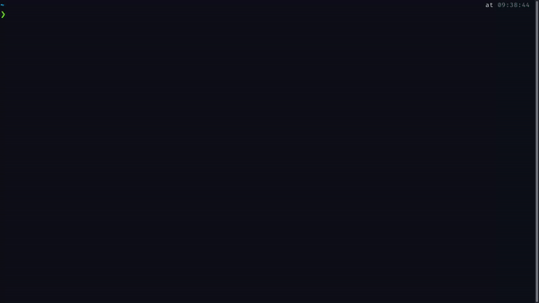

# Git Stalker


Stalk GitHub users without leaving your terminal.



## Install

```bash
$ npm i -g git-stalker

# or using yarn

$ yarn global add git-stalker
```

## Usage

```bash
$ stalk <username>

# For example
$ stalk godcrampy
```

## Authors

- **Sahil Bondre** - [godcrampy](https://github.com/godcrampy)

## License

This project is licensed under the MIT License - see the [LICENSE](LICENSE) file for details
